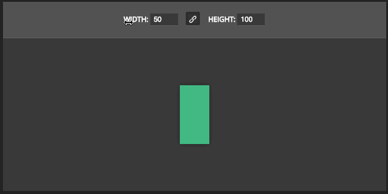

# Vue Draggable Number

A simple number input component that users can edit by dragging the label around, inspired by Photoshop UX.

Written in Typescript.

**Full demo**: https://sunyatasattva.github.io/vue-draggable-number/



## Basic usage

```html
<template>
  <div>
   <draggable-number-input v-model="someNumber" label="My number" />
  </div>
</template>

<script>
  export default {
    data() {
      return {
        someNumber: 1,
      };
    },
  };
</script>
```

This will create an unstyled HTML5 `<input type="number">` tied to `someNumber`, the value of which the user can easily increase or decrease by dragging (respectively) up and down on the label.

The only two required properties are `label` and `value` (in the example case, handled through the `v-model` syntactic sugar).

### Allowed props

| Property | Description | Type | Default | Options |
|---------------|----------------------------------------------------------------------------------------------------------------------|---------|-----------|--------------|
| dragDirection | The axis in which the user has to drag to increase/decrease the number. | String | "Y" | "X" | "Y" |
| hideLabel | Whether or not to hide the label. | Boolean | false | true | false |
| label | The label to show next to the input. It is also used to generate the name of the input and the class of the wrapper. | String | - | - |
| max | Maximum allowed value. | Number | Infinity | - |
| min | Minimum allowed value. | Number | -Infinity | - |
| step | The amount by which the value is increased on mouse movement. | Number | 1 | - |
| value | The value of the input. | Number | - | - |

The generated HTML looks like this:

```html
<div class="vue-draggable-number-container ${generatedInputName}">
  <label for="${generatedInputName}"> {{ label }} </label>
  <input type="number" name="${generatedInputName}" />
</div>
```

Where `${generatedInputName}` is `draggable-number-` plus the _kebab-cased_ label.

These are useful to target the component for styling.